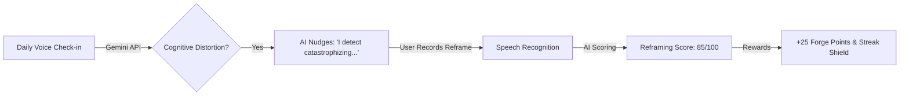
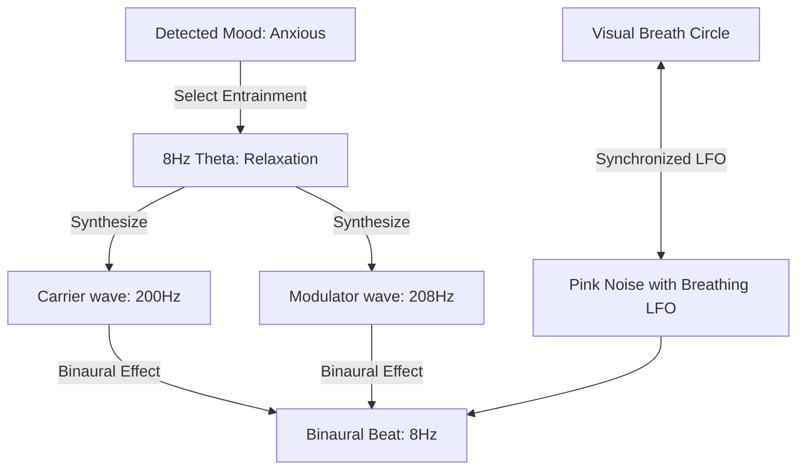

# FORGE — Master Innovation & Execution Blueprint (2026)

This document serves as our product specification and developer blueprint for building high-value, highly interactive, and premium features for **FORGE** that are typically locked behind expensive paywalls in commercial self-growth applications.

Every feature detailed below is designed with **zero-token local execution** or **cost-efficient hybrid patterns** in mind, adhering to the highest industry standards for code architecture, performance, edge-case mitigation, and test coverage.

---

## 🌌 Feature 1: Interactive Voice CBT & Distortion Sandbox ("Mind Forge")
*A conversational cognitive restructuring tool that listens, critiques, and helps you reframe negative thoughts.*



### 🛠️ End-to-End Implementation Approach
1. **Detection Pipeline**:
   * Update the prompt in [src/app/api/analyze/route.ts](file:///Users/priyanshsmac/Desktop/new_projet/src/app/api/analyze/route.ts) to identify cognitive distortions:
     ```typescript
     cognitiveDistortion: {
       detected: boolean,
       type: "catastrophizing" | "emotional_reasoning" | "all_or_nothing" | "personalization" | "should_statements" | "none",
       snippet: string, // The exact words containing the distortion
       explanation: string // Why it is a distortion and how to reframe
     }
     ```
2. **State Machine (`src/app/(main)/record/page.tsx`)**:
   * Add a state `DISTORTION_ALERT` and `REFRAMING_SESSION`.
   * If `cognitiveDistortion.detected === true`, pivot the UI into the **Mind Forge Distortion Sandbox**.
3. **Reframing Dialog**:
   * Show the user their distortion snippet.
   * AI voice synthesis (via SpeechSynthesis API) reads the explanation.
   * Start a second recording block where the user provides a logical alternative.
   * Send the reframed transcript back to a `/api/reframe` route to calculate a score from 1-100.
4. **Zustand Integration**:
   * Save the completed reframing logs in the `entries` table under a new jsonb column `cbt_data` and trigger a points payout.

### ⚠️ Edge Cases & Failure Modes
* **Background Tab Inactivity**: If the user switches tabs during the synthesis or voice capture, standard timers freeze.
  * *Mitigation*: Utilize the Web Page Visibility API (`document.visibilityState`) to pause the playback and restart speech recognition cleanly upon return.
* **Microphone Disconnection Midway**:
  * *Mitigation*: Listen to browser `devicechange` events via `navigator.mediaDevices`. If the input device is disconnected, immediately pause the state machine, prompt the user, and fallback to manual text input.
* **SpeechRecognition API Failure (e.g., Network timeout)**:
  * *Mitigation*: Wrap SpeechRecognition in a timeout handler. If no text is transcribed within 8 seconds of active speech, display a text-area input field immediately so the session does not freeze.

### 🧪 Test Cases & Verification Suite
1. **Distortion Detection Matcher**:
   * *Input*: "Everything is ruined. I missed one habit and now I'll never succeed at anything."
   * *Assert*: API returns `detected: true`, `type: "all_or_nothing"`.
2. **Reframe Score Verification**:
   * *Input*: "It was just one day, I can reset tomorrow. Missing one day does not erase my past 10 days of progress."
   * *Assert*: Score is evaluated above 75, triggering point payout.
3. **Interrupt Scenario**:
   * Trigger mic permission rejection during the Reframing block. Confirm the app swaps to text entry without throwing unhandled exceptions.

### 📐 Best Coding Practices
* **Strict Typing**: Create explicit interfaces for `CbtSessionState` and `DistortionReport`.
* **State Isolation**: Encapsulate the voice recognition listener within a custom React hook `useVoiceDictation.ts` to keep `record/page.tsx` readable.

---

## 🎧 Feature 2: Synthesized "Focus Forge" Soundscapes
*Algorithmic binaural beats and ambient noise synthesizers generated completely client-side.*



### 🛠️ End-to-End Implementation Approach
1. **Audio Synthesis Hook (`src/hooks/useSoundscape.ts`)**:
   * Create a single, lazy-loaded global `AudioContext` using a ref.
   * Synthesize binaural beats using two `OscillatorNode` instances routed through a `ChannelMergerNode` to left and right channels.
   * Generate Pink Noise programmatically using a custom `AudioBuffer` fill loop and run it through a `BiquadFilterNode` (lowpass).
   * Implement LFO oscillation: Automate the filter's `.frequency.setValueAtTime` and `.linearRampToValueAtTime` values to sweep between `250Hz` (exhale/hold) and `950Hz` (inhale).
2. **React Interface (`src/components/timer/SoundscapePanel.tsx`)**:
   * Render sliders for Beats Volume, Ambient Volume, and Master Volume.
   * Add a circular, pulsing breathing indicator (Box Breathing: 4s Inhale, 4s Hold, 4s Exhale, 4s Hold).
3. **Timer Page Hook-up (`src/app/(main)/timer/page.tsx`)**:
   * Read the Pomodoro timer state from Zustand `useTimerStore`. When the timer starts/pauses, trigger the soundscape's play/pause state in sync.

### ⚠️ Edge Cases & Failure Modes
* **Autoplay Blocked**: Browsers block audio before interaction.
  * *Mitigation*: Keep the AudioContext in suspended state initially. Resume it *only* during the `onClick` handler of the "Start Timer" or "Play Soundscape" buttons.
* **Audio Glitches/Clicks on Toggle**:
  * *Mitigation*: Never call `oscillator.stop()` abruptly. Use `gainNode.gain.exponentialRampToValueAtTime(0.001, audioCtx.currentTime + 0.15)` to fade audio to zero before disconnecting nodes.
* **CPU Starvation**: Heavy audio synthesis loops can stutter if the main thread is busy with animations.
  * *Mitigation*: Offload the buffer generation to helper functions that run only once when the page mounts, caching the noise buffers in memory.

### 🧪 Test Cases & Verification Suite
1. **Stereo Beats Verification**:
   * Confirm oscillator frequency parameters: Left = 200Hz, Right = 212Hz (asserts Delta = 12Hz Alpha beat).
2. **Audio Fading Timeouts**:
   * Click Play then immediate Pause. Confirm that no pops/clicks occur and nodes are disconnected exactly after the gain reaches 0.
3. **Multiple Context Protection**:
   * Navigate away from `/timer` to `/dashboard` and back. Confirm only a single `AudioContext` exists and the previous context was closed successfully to prevent resource leak warnings.

### 📐 Best Coding Practices
* **Resource Cleanup**: Unbind all audio nodes and close the `AudioContext` on component unmount.
* **Single Source of Truth**: Link the lowpass filter automation directly to the visual breathing timer variables using a shared state manager or a single requestAnimationFrame loop.

---

## 🕸️ Feature 3: The "Mind Palace" Theme & Mood Correlation Graph
*An interactive network graph showing the hidden relationships between your daily habits, themes, and emotional tone.*

```
   [ Work Deadline ]  ====== (Anxious: 80% / Energy: 8.5)
          ||
          || correlates with
          \/
   [ Habit: Meditation ] ==== (Failed: 90% of the time)
          ||
          || causes
          \/
   [ Tone Score ] ========== (Drops by 2.4 points)
```

### 🛠️ End-to-End Implementation Approach
1. **Metadata Ingestion**:
   * Update [src/app/(main)/record/page.tsx](file:///Users/priyanshsmac/Desktop/new_projet/src/app/(main)/record/page.tsx) to pass the daily transcript to a local NLP extractor (keyword mapping) or the Gemini API to output an array of themes: `["work", "caffeine", "relationship", "sleep"]`.
   * Store these themes in a new text array column `themes` in the `entries` table.
2. **Correlation Endpoint (`src/app/api/correlations/route.ts`)**:
   * Fetch the last 30 entries and habit logs.
   * Run a correlation algorithm calculating the Pearson correlation coefficient between specific tags, average tone scores, and habit completion rates.
3. **Animated Visualizer (`src/app/(main)/palace/page.tsx`)**:
   * Render an interactive HTML5 Canvas or SVG network graph with force-directed physics.
   * Render nodes for Themes, Habits, and Emotions. Color-code paths: Green for positive correlations, Red for negative.

### ⚠️ Edge Cases & Failure Modes
* **Sparse Data (New Users)**: If the user has only 1 or 2 entries, correlations are mathematically meaningless or divide-by-zero.
  * *Mitigation*: Display a beautiful glassmorphic empty state suggesting: *"Log at least 5 check-ins to build your Mind Palace connection map."*
* **Node Clustering Overlap**: In screen views with 20+ nodes, they may clump together.
  * *Mitigation*: Implement standard collision physics in the Canvas loop and a slider to adjust graph zoom/node repulsion force.

### 🧪 Test Cases & Verification Suite
1. **Math Integrity Test**:
   * Feed mockup data containing constant mentions of "social media" with low tone scores. Confirm correlation coefficient returns a negative value.
2. **Canvas Performance Test**:
   * Simulate 100 nodes. Confirm frame rates stay above 55 FPS by profiling the rendering engine.
3. **Empty Data Fallback**:
   * Log in as a new user with empty records. Confirm page renders the tutorial/intro UI without throwing database array errors.

### 📐 Best Coding Practices
* **Memoized Computations**: Wrap the correlation calculator in `useMemo` so shifting views does not re-compute statistical arrays.
* **Declarative Canvas Drawing**: Isolate canvas frame updating to a clean `requestAnimationFrame` hook with proper cleanup to prevent memory leaks.

---

## 🛡️ Feature 4: Gamified Streak Insurance & Resiliency Shop ("Forge Shop")
*A behavioral design loop that rewards resilience over perfection, preventing streak-loss abandonment.*

### 🛠️ End-to-End Implementation Approach
1. **Database Schema Update**:
   * Add `streak_shields` (integer, default 0) to the `profiles` table.
   * Add a `points_log` entry types for shop purchases.
2. **Purchase RPC Function (`complete_purchase`)**:
   * Create a Supabase PostgreSQL RPC function to handle purchases atomically:
     ```sql
     create or replace function buy_streak_shield(user_id uuid, cost integer)
     returns boolean as $$
     declare
       current_points integer;
     begin
       select total_points into current_points from public.profiles where id = user_id;
       if current_points >= cost then
         update public.profiles 
         set total_points = total_points - cost,
             streak_shields = streak_shields + 1
         where id = user_id;
         insert into public.points_log (user_id, action, points)
         values (user_id, 'Purchased Streak Shield', -cost);
         return true;
       else
         return false;
       end if;
     end;
     $$ language plpgsql security definer;
     ```
3. **Streak Shield Logic**:
   * Update the check-in script: When checking if the streak is broken, check if `streak_shields > 0`. If yes, decrement the shield count by 1 and preserve the streak instead of resetting it.

### ⚠️ Edge Cases & Failure Modes
* **Point Double-Spending**: Fast concurrent clicks trigger parallel calls, buying items twice before the profile points deduct.
  * *Mitigation*: The postgres database RPC transaction locks the profile row (`SELECT FOR UPDATE`), ensuring only one buy query evaluates at a time. The client also disables the purchase button immediately on click.
* **Offline Point Sync Drift**: User attempts to purchase a shield when offline.
  * *Mitigation*: Do not update points client-side until the Supabase RPC return confirms success. If the write fails, trigger a warning toast and reset the loading spinner.

### 🧪 Test Cases & Verification Suite
1. **RPC Purchase Limits**:
   * Mock profile with 50 points. Attempt to buy an item costing 100 points. Assert transaction returns `false` and database points remain 50.
2. **Concurrency Verification**:
   * Send 5 simultaneous buy requests. Confirm that only 1 evaluates as true, points decrement exactly once, and shield count increases by exactly 1.
3. **Streak Preservation Run**:
   * Mock user with streak of 5, shield of 1, and no check-in yesterday. Run check-in today. Verify streak equals 6, and shield count decrements to 0.

### 📐 Best Coding Practices
* **Database Constraints**: Enforce check constraints on points: `alter table profiles add constraint positive_points check (total_points >= 0)`.
* **Optimistic Rollback**: Always use complete transactional states; only commit point changes on the frontend *after* backend confirmation.

---

## 🔒 Feature 5: Offline Local-First Vault with Sub-millisecond Encrypted Sync
*Zero-server, local-first database vault utilizing IndexDB + AES-GCM encryption in the browser.*

### 🛠️ End-to-End Implementation Approach
1. **Local-First Database (RxDB / Dexie.js)**:
   * Setup a local database utilizing IndexedDB for journal entries, habits, and timers.
2. **AES-GCM Encryption**:
   * Implement encryption in a Web Worker using the browser's native Web Crypto API (`window.crypto.subtle`).
   * When a user records or writes a reflection, the string is encrypted client-side using a locally input master key (derived using PBKDF2).
3. **Encrypted Sync to Supabase**:
   * Upload only the ciphertext to the database. The server never has access to the encryption key or the decrypted reflection text, ensuring complete privacy.

### ⚠️ Edge Cases & Failure Modes
* **Lost Master Password**: If the user loses their password, their data cannot be recovered.
  * *Mitigation*: Generate and require downloading a recovery PDF key during vault setup. Show clear warnings that support agents cannot reset local keys.
* **Storage quota limits**: If browser storage runs low, IndexedDB might clear.
  * *Mitigation*: Request persistent storage permissions using `navigator.storage.persist()`.

### 🧪 Test Cases & Verification Suite
1. **Crypto Verification**:
   * Encrypt a text block, push to database, fetch directly from Supabase, confirm content is unintelligible ciphertext.
2. **Offline Buffer Sync**:
   * Write 3 entries offline. Go online. Verify that sync queue uploads all 3 entries sequentially without data loss or conflicts.

---

## 📈 Feature 6: Adaptive "Pomodoro Flow" Workload Adjuster
*An intelligent focus timer that tracks completion rates and dynamically recalibrates timer intervals.*

### 🛠️ End-to-End Implementation Approach
1. **Metrics Collection**:
   * Track focus session pauses and completions in `useTimerStore`.
2. **Adaptive Algorithm (Local)**:
   * Run a local heuristic calculating the user's focus efficiency:
     $$\text{Focus Efficiency} = \frac{\text{Sessions Completed}}{\text{Sessions Attempted}} \times (1 - 0.1 \times \text{Pauses})$$
3. **Automatic Adjustments**:
   * If efficiency drops below 0.6, suggest reducing session duration (e.g. from 25 min to 15 min) or increasing break times.

### ⚠️ Edge Cases & Failure Modes
* **Premature suggestions**: Prompting the user after just one bad session is annoying.
  * *Mitigation*: Run calculations only on rolling 3-day windows or groups of 5+ sessions.

### 🧪 Test Cases & Verification Suite
1. **Efficiency Calculator Math**:
   * Assert calculation results match specific targets (e.g. 3 completed, 4 started, 2 total pauses = 67.5% efficiency).
2. **Adaptive Modal Prompt**:
   * Set efficiency to 0.4. Verify a non-intrusive glassmorphic recommendation card appears suggesting a shorter focus interval.
