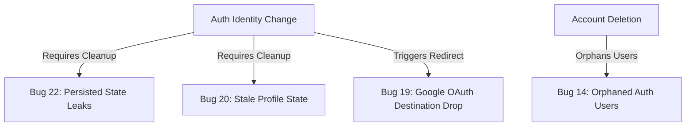

# FORGE — Prioritized & Interrelated Bug Catalog

This document organizes outstanding bugs and feature gaps from [BUGS.md](file:///Users/priyanshsmac/Desktop/new_projet/BUGS.md) into interrelated groups. Each issue is categorized by **Urgency** and **Complexity**, and mapped directly to the core files they touch.

---

## 🚀 Category 1: Auth, Security & State Transitions (Interrelated)

These issues are highly interrelated because they deal with user sessions, data isolation on shared devices, and secure identity mapping. Resolving one helps design a cleaner auth-lifecycle pattern.

### 14. Orphaned Auth Users on Account Deletion
*   **Urgency**: 🔴 Urgent (High risk of orphaned records & crashes upon user re-registration)
*   **Complexity**: 🔥 Hard (Requires admin-scoped Next.js API route / Supabase Edge Function using `service_role` to delete from `auth.users`)
*   **Core Files**: [settings/page.tsx](file:///Users/priyanshsmac/Desktop/new_projet/src/app/(main)/settings/page.tsx)

### 20. User Profile State Can Stale Across Auth Transitions
*   **Urgency**: 🔴 Urgent (Prevents UI from displaying correct user stats, avatar, and streaks after swapping accounts)
*   **Complexity**: 🟡 Medium (Must explicitly nullify the profile in the store on sign-out or account change)
*   **Core Files**: [useUserStore.ts](file:///Users/priyanshsmac/Desktop/new_projet/src/stores/useUserStore.ts), [AuthProvider.tsx](file:///Users/priyanshsmac/Desktop/new_projet/src/components/layout/AuthProvider.tsx)

### 22. Persisted App State Leaks Across Users (localStorage)
*   **Urgency**: 🔴 Urgent (Data privacy issue: stats, sound settings, and custom presets leak between users on shared devices)
*   **Complexity**: 🟡 Medium (Must namespace localStorage keys with `user.id` or clear the store completely on auth changes)
*   **Core Files**: [useTimerStore.ts](file:///Users/priyanshsmac/Desktop/new_projet/src/stores/useTimerStore.ts), [AuthProvider.tsx](file:///Users/priyanshsmac/Desktop/new_projet/src/components/layout/AuthProvider.tsx)

### 19. Google OAuth Drops the Intended Redirect Destination
*   **Urgency**: 🟡 Moderate (Annoying UX: always redirects users to `/dashboard` even if they tried opening a deep-link)
*   **Complexity**: 🟡 Medium (Thread `redirectTo` search params through the OAuth loop and handle it in the callback route)
*   **Core Files**: [AuthGuard.tsx](file:///Users/priyanshsmac/Desktop/new_projet/src/components/layout/AuthGuard.tsx), [login/page.tsx](file:///Users/priyanshsmac/Desktop/new_projet/src/app/(auth)/login/page.tsx), [useAuth.ts](file:///Users/priyanshsmac/Desktop/new_projet/src/hooks/useAuth.ts), [route.ts](file:///Users/priyanshsmac/Desktop/new_projet/src/app/auth/callback/route.ts)

### 8. Hardcoded Supabase Redirect Rules (OAuth Fallbacks)
*   **Urgency**: 🟢 Low (Only affects redirection behaviors in production and staging builds)
*   **Complexity**: 🟢 Easy (Requires adjusting settings on the Supabase dashboard rather than code edits)
*   **Core Files**: Configuration within the Supabase Dashboard

---

## 🔒 Category 2: Transactional Logic & Error Handling (Interrelated)

These bugs focus on database write safety. In Next.js/Supabase, optimistic UI updates and concurrent queries can drift out of sync if failures are unhandled or split across multiple client calls.

### 15. Non-Transactional Points Logging (Risk of Sync Drift)
*   **Urgency**: 🔴 Urgent (Network drops or query failures cause database total points to mismatch the action history logs)
*   **Complexity**: 🔥 Hard (Requires creating a PostgreSQL Remote Procedure Call `complete_focus_session` function to commit updates atomically)
*   **Core Files**: [GlobalTimerOverlay.tsx](file:///Users/priyanshsmac/Desktop/new_projet/src/components/timer/GlobalTimerOverlay.tsx), SQL Schema Migration

### 21. Skip Point Awards While Profile Loading
*   **Urgency**: 🔴 Urgent (Race condition: completing a focus session right after bootup skips updating points because the user store has not finished loading)
*   **Complexity**: 🟡 Medium (Queue the point award until the profile is hydrated or defer it completely to an API/RPC call)
*   **Core Files**: [GlobalTimerOverlay.tsx](file:///Users/priyanshsmac/Desktop/new_projet/src/components/timer/GlobalTimerOverlay.tsx)

### 23. Focus Session Completion Treats Supabase Writes as Successful Even When They Fail
*   **Urgency**: 🔴 Urgent (Silent data loss: client does not check the returned `{ error }` object from Supabase, assuming all writes succeed)
*   **Complexity**: 🟢 Easy (Add error checks for Supabase query returns and rollback/alert the user using toasts)
*   **Core Files**: [GlobalTimerOverlay.tsx](file:///Users/priyanshsmac/Desktop/new_projet/src/components/timer/GlobalTimerOverlay.tsx)

### 13. Unhandled Supabase Errors in Settings Data Export
*   **Urgency**: 🟡 Moderate (Data integrity: export yields an incomplete JSON with null fields on database errors without notifying the user)
*   **Complexity**: 🟢 Easy (Check and propagate the returned `error` properties inside the `Promise.all` block)
*   **Core Files**: [settings/page.tsx](file:///Users/priyanshsmac/Desktop/new_projet/src/app/(main)/settings/page.tsx)

---

## 📝 Category 3: Journal & Content Experience (Interrelated)

These issues revolve around the journal feed, metadata rating logs, and general user interface layouts when handling large text content.

### 3. Journal Editing and Retention (Recycle Bin)
*   **Urgency**: 🟡 Moderate (Required core feature: user cannot edit typos or retrieve accidentally deleted items)
*   **Complexity**: 🔥 Hard (Requires database column migration `deleted_at`, edit forms, and automatic database garbage collection after 10 days)
*   **Core Files**: [journal/page.tsx](file:///Users/priyanshsmac/Desktop/new_projet/src/app/(main)/journal/page.tsx), SQL Schema Migration

### 11. Journal Lacks Title and Day Rating
*   **Urgency**: 🟡 Moderate (Missing metadata: limits daily review and coach tracking without titles or emoji ratings)
*   **Complexity**: 🟡 Medium (Requires database schema update and adding input controls in the journal creation sheet)
*   **Core Files**: [journal/page.tsx](file:///Users/priyanshsmac/Desktop/new_projet/src/app/(main)/journal/page.tsx), SQL Schema Migration

### 24. Journal Load Failures Are Hidden Behind the Empty-State UI
*   **Urgency**: 🟡 Moderate (Bad diagnostics: RLS blocks or offline states make it look like the user has no entries rather than showing an error)
*   **Complexity**: 🟢 Easy (Add a boolean `error` state and display a custom error callout with a "Retry" button)
*   **Core Files**: [journal/page.tsx](file:///Users/priyanshsmac/Desktop/new_projet/src/app/(main)/journal/page.tsx)

### 10. Large Journal Entries Break UX
*   **Urgency**: 🟢 Low (Cosmetic: long paragraphs overflow the vertical view space of cards)
*   **Complexity**: 🟢 Easy (Apply CSS line-clamping or add a "Read More" button toggle)
*   **Core Files**: [journal/page.tsx](file:///Users/priyanshsmac/Desktop/new_projet/src/app/(main)/journal/page.tsx)

---

## 🎨 Category 4: Mockups & Core Features (Interrelated)

These three modules represent features defined in the schema but currently lacking real frontend logic or backend integration.

### 4. Static Record Page Mockup (Voice Check-ins)
*   **Urgency**: 🟡 Moderate (Core check-in voice record feature does not work)
*   **Complexity**: 🔥 Hard (Integrate browser `MediaRecorder` API, WAV compression, upload to Supabase Storage bucket, and insert entry row)
*   **Core Files**: [record/page.tsx](file:///Users/priyanshsmac/Desktop/new_projet/src/app/(main)/record/page.tsx)

### 5. Static Dashboard Overview
*   **Urgency**: 🟡 Moderate (All stats cards are hardcoded to zero; AI Coach gives static placeholder advice)
*   **Complexity**: 🔥 Hard (Must fetch and aggregate streak/focus metrics from Supabase logs and call Gemini API for advice)
*   **Core Files**: [dashboard/page.tsx](file:///Users/priyanshsmac/Desktop/new_projet/src/app/(main)/dashboard/page.tsx)

### 7. Unimplemented Habit Tracking Features
*   **Urgency**: 🟡 Moderate (The habits UI page is missing entirely despite table schemas existing in the database)
*   **Complexity**: 🔥 Hard (Requires writing a full view, add habit controls, streak checkers, and check-off logger)
*   **Core Files**: Needs new page at `/habits` or within dashboard routes

---

## 📱 Category 5: PWA & Notifications Infrastructure (Interrelated)

These tasks cover PWA standard capabilities like offline support and local background push notifications.

### 16. Missing PWA Service Worker Registration
*   **Urgency**: 🟡 Moderate (PWA will not support offline caching or install prompts on standard devices without a service worker)
*   **Complexity**: 🔥 Hard (Add service worker script to the public folder and register it correctly in layout)
*   **Core Files**: `public/sw.js` (to create), [layout.tsx](file:///Users/priyanshsmac/Desktop/new_projet/src/app/layout.tsx)

### 6. Notifications Toggle Inoperability
*   **Urgency**: 🟢 Low (Toggling reminders saves status in store but does not request browser permissions or schedule alarms)
*   **Complexity**: 🟡 Medium (Must call `Notification.requestPermission()` and schedule background worker alarms)
*   **Core Files**: [settings/page.tsx](file:///Users/priyanshsmac/Desktop/new_projet/src/app/(main)/settings/page.tsx), `public/sw.js`

---

## ✅ Category 6: Recently Resolved Issues
These issues have been fully resolved during our recent optimization pass:
*   **Bug 1**: Custom Timer Input Parsing & Limits (Float inputs properly converted to seconds).
*   **Bug 2**: Audio Playback Failures (URL playbacks fully replaced with Web Audio API synthesis).
*   **Bug 9**: Timer Resets on Tab Change (Timer moved to global Zustand state with overlay support).
*   **Bug 12**: Pausing Custom Timer State Corruption (Inputs disabled during active/paused sessions).
*   **Bug 17**: Thread Freezing from Synchronous Alerts (Blocking alerts replaced with non-blocking Sonner toasts).
*   **Bug 18**: Unvalidated Custom Timer Durations (Minimum bounds locked at 30 seconds).
